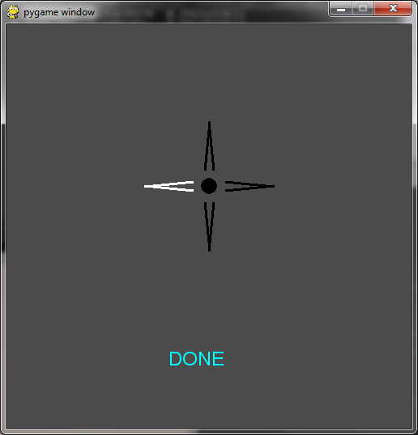
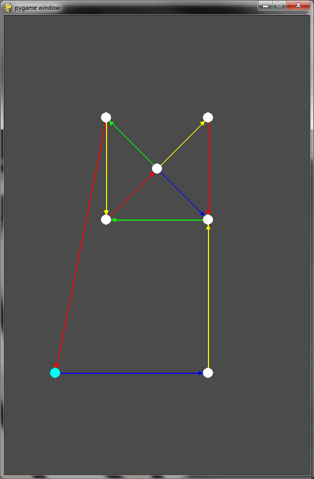

Using the environment
=======================

Overview
------------

The environment consists of few major parts:
    * server.py -- main communication server
    * learner.py -- BCI interface and SVM classifier
    * newrender.py -- raw data access GUI
    * graph_test.py -- experimental graph display
    
    
Communication is handled by tcp sockets via port 31415

server.py
-----------
See :doc:`/server`

The server routes packets received from *learner* and transfers them to all instances of *newrender* and 
*graph_test* that are running and connected to the host.

When an application connects to a server, it sends a string that identifies it:
    * GRAPH for *graph_test*
    * LEARNER for *learner*
    * RENDERER for *newrender*
    
When the server accepts the connection, it sends an *OKK* string as an acknowledgement. 

Packet types
^^^^^^^^^^^^^^^^

A packet is a binary string transferred through a socket.
There are several kinds of packets used in the project:

=======  ============  ========
Header   Data          Description
=======  ============  ========
OKK      <None>        Standard connection acknowledgement
D        pickled data  Data packet format :ref:`more <pickle-description>`
C        state         A state change that is sent only to *graph_test*
=======  ============  ========

.. _pickle-description:

Pickle description
^^^^^^^^^^^^^^^^^^^^
A data packet is a triple that consists of:
    * current detected direction (int) 
    * battery percentage (int) 
    * dictionary of sensor information (quintuples accessed through sensor names (i.e.. *AF3*)):
    
        * sensor quality (0..12)
        * sensor value (mV)
        * list of Fourier coefficients 
        * power of alpha spectrum
        * power of beta spectrum
       

learner.py
-----------
See :doc:`/learner`

    
    learner.py

    
Learner module is used to obtain and pre-process data from EEG.
It also detects a preferred direction using SVM algorithm.
All data is then sent to the server.

See :doc:`/svm_train`
and :doc:`/parameters`

newrender.py
--------------
See :doc:`/newrender`

.. figure:: images/render.png
    :figwidth: 80%
    :align: center
    
    newrender.py
    
    ========== =============
    Number     Description
    ========== =============
    1          Raw EEG display
    2          EEG FFT
    3          Sensor reading quality
    4          Direction detection
    ========== =============

Newrender connects to the server and displays received data in a user-friendly way.

    
graph_test.py
---------------
See :doc:`/graph`

    
    graph_test.py

graph_test is an experimental feature and will soon be further developed and documented. 
